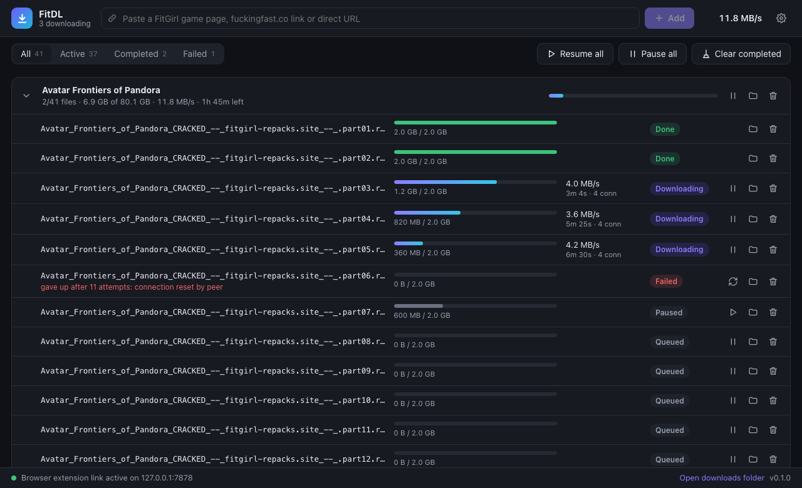
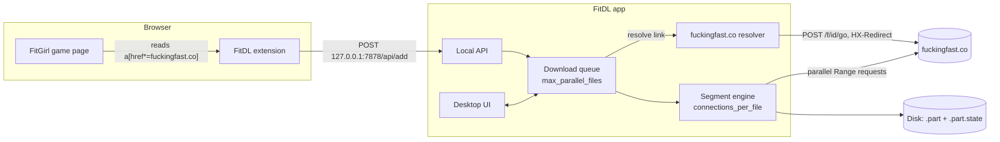

<div align="center">


# FitDL

**A fast, resumable, IDM-style downloader for FitGirl Repacks, with a browser extension.**

Open a game page, click one button, and every `fuckingfast.co` file is queued and downloaded
over several connections at once. Downloads survive pauses, crashes, reboots and expired links
without ever leaving a broken file behind.

[](https://github.com/vikashsharma26/fitgirl-repack-downloader/actions/workflows/ci.yml)


[](LICENSE)



</div>

## Features

- **Multi-connection downloads.** Each file is split into segments fetched in parallel with HTTP
  range requests. When a connection finishes early it takes over half of the biggest remaining
  segment (IDM's *dynamic segmentation*), so every connection stays busy until the very end.
- **Never breaks a file.**
  - Data is written to `name.part`, and progress to `name.part.state`, only after the data is
    flushed to disk.
  - Every server response is checked: the byte offset, the total size, and whether the server
    ignored the range request.
  - The file only gets its real name after its final size is verified.
- **Resume anything.** Pause, quit, crash or lose power, and the download continues from where it
  stopped. Expired download links are resolved again automatically, and progress is kept.
- **One-click scraping.** Finds every `<a>` pointing at `fuckingfast.co` on a FitGirl page and
  keeps its text. Files are saved under their real names, so FitGirl's MD5 check still works.
  Optional packs (`fg-optional-*`: language packs, bonus content) are recognised and left
  unselected by default.
- **Browser extension.**
  - A *Download with FitDL* button on every game page.
  - A popup to pick which files to download.
  - A link counter badge.
  - A right-click *Download with FitDL* entry for any link.
- **Desktop app.**
  - Downloads are grouped by game, with speed, ETA and per-file connection counts.
  - Pause, resume and retry per file or per game.
  - Keeps running in the system tray.
- **Configurable like IDM.** Set parallel files, connections per file, a global speed limit,
  retries, buffer sizes and more, in the app or in `config.toml`.
- **Also a CLI.** `fitdl get <game page>` works headless, for example on a server.

## How it works



1. **Scrape.** The extension (or the app, when you paste a page URL) collects every link whose
   host is `fuckingfast.co`, keeping the link text and the real file name from the URL's `#fragment`.
2. **Resolve.** Right before a file starts, its `fuckingfast.co/<id>` page is turned into a signed
   direct link, the same way the site's DOWNLOAD button does. Links expire, which is why this
   happens as late as possible.
3. **Download.** The engine probes the file, splits it into segments and downloads them in
   parallel. Progress is saved every couple of seconds.

## Install (Windows)

1. Download `FitDL_x.y.z_x64-setup.exe` from the
   [latest release](https://github.com/vikashsharma26/fitgirl-repack-downloader/releases) and run it.
2. Install the browser extension (Chrome, Edge, Brave or Opera):
   1. Download and unzip `fitdl-extension.zip`.
   2. Open `chrome://extensions` or `edge://extensions` and turn on **Developer mode**.
   3. Click **Load unpacked** and select the unzipped folder.
3. Start FitDL, open any FitGirl game page, and click **Download with FitDL**.

## Usage

### Desktop app

- **Add downloads.** Paste a game page, a `fuckingfast.co` link or any direct URL into the top bar.
  Game pages open a file picker with the main parts selected and optional packs unselected.
- **Control downloads.** Pause, resume and retry per file, per game, or everything at once.
  Failed files show the reason.
- **Close the window freely.** Downloads keep running in the tray. Use **Quit** in the tray menu
  to stop; progress is saved and continues on the next start.

### Browser extension

| Where | What it does |
| --- | --- |
| Button under the game title | Queues all main files (optional packs excluded) |
| Toolbar popup | Lets you choose files, including optional packs |
| Right-click on a link | **Download with FitDL** queues that link |

The extension talks to the app on `127.0.0.1:7878`. If you change the port in the app, set the
same port at the bottom of the popup.

### Command line

```text
fitdl get <URL>...        Download game pages, fuckingfast.co links or direct URLs
    --optional            also download fg-optional-* files
    -d, --dir <DIR>       download folder
    -p, --parallel <N>    files at the same time
    -c, --connections <N> connections per file
fitdl scrape <PAGE>       List a game page's download links (--json for JSON)
fitdl serve               Run headless with the API, for the extension
fitdl config              Show the config file
```

Press `Ctrl+C` to pause. Running the same command again resumes.

## Configuration

Settings live in `%APPDATA%\FitDL\config.toml`. The file is created with comments on first start,
and you can edit it there or in **Settings** in the app. For a portable install, put a
`config.toml` next to `FitDL.exe`.

| Setting | Default | Meaning |
| --- | --- | --- |
| `download_dir` | `Downloads\FitDL` | Where files are saved |
| `subfolder_per_game` | `true` | Save each game in its own folder |
| `max_parallel_files` | `3` | Files downloading at the same time |
| `connections_per_file` | `4` | Parallel connections per file (1–32) |
| `speed_limit_kbps` | `0` | Global limit in KB/s, `0` = unlimited |
| `min_segment_size_mb` | `4` | Segments are never split below this |
| `buffer_size_kb` | `1024` | Per-connection write buffer |
| `max_retries` | `10` | Failures allowed per segment without progress |
| `retry_backoff_ms` | `2000` | First retry delay (doubles, max 60 s) |
| `state_save_interval_s` | `2` | How often progress is saved to disk |
| `server_port` | `7878` | Local API port for the extension |

> **Tip:** more connections is not always faster. Many hosts limit bandwidth per IP, so
> 2–4 files × 4 connections is usually the sweet spot. Measure on your own connection.

## Build from source

Requirements: [Rust](https://rustup.rs) (stable) and Node.js 20+. On Windows you also need the
WebView2 runtime, which ships with Windows 10 and 11.

```sh
# Engine, scraper, core and CLI: tests and CLI binary
cargo test --workspace --exclude fitdl-app
cargo build --release -p fitdl-cli          # target/release/fitdl(.exe)

# Desktop app
cd app
npm install
npm run tauri dev                           # run with hot reload
npm run tauri build -- --bundles nsis,msi   # Windows installer
```

Pushing a tag like `v0.1.0` makes GitHub Actions build the installer, CLI and extension zip and
attach them to a draft release.

### Project layout

```text
crates/
  engine/    Segmented, resumable HTTP download engine (site-agnostic)
  scraper/   FitGirl page parser + fuckingfast.co link resolver
  core/      Config, persistent queue, local API for the extension
  cli/       `fitdl` command-line app
app/         Desktop app: Tauri 2 (Rust) + Svelte 5 UI
extension/   Manifest V3 browser extension
```

### Tests

Everything under `cargo test` runs offline against a local test server that imitates real-world
hosts, including:

- a server that reports a wrong `Content-Range` end, like fuckingfast.co does
- a server that ignores range requests
- random `500` errors and connections dropped mid-transfer
- pause and resume
- a simulated crash followed by resume
- cancel, expired links and speed limiting

Every test checks the downloaded file's SHA-256.

A live test against the real sites runs on demand:

```sh
cargo test -p fitdl-scraper --test live -- --ignored --nocapture
```

## Notes

- `fuckingfast.co` sits behind Cloudflare, which rejects many HTTP clients by fingerprint. FitDL
  sends requests the way browsers do: HTTP/1.1, with `Host`, `User-Agent` and `Accept` first and
  in title case. If the site changes its download flow, the resolver in
  `crates/scraper/src/fuckingfast.rs` is the only place to update.
- FitDL is an independent project, not affiliated with FitGirl Repacks or fuckingfast.co.
  Only download content you have the right to download.

## License

[MIT](LICENSE)
